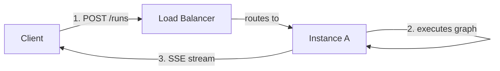
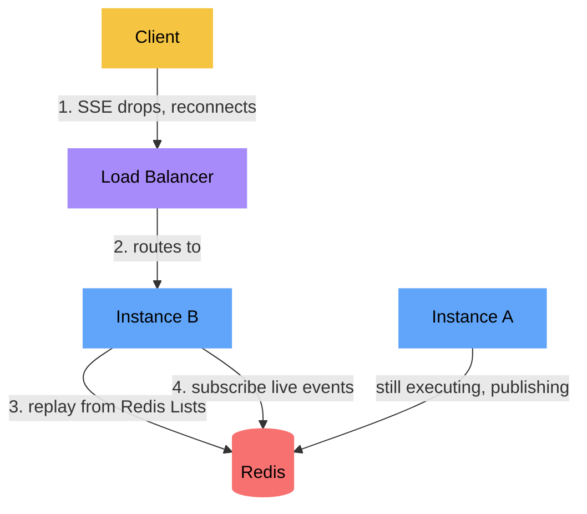
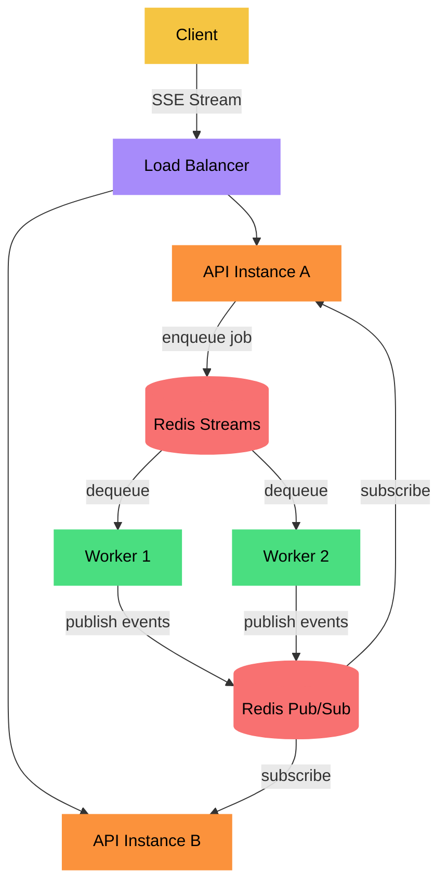

# Aegra Streaming Architecture

## Current: Unified Broker with Replay (v0.9)

### Normal Flow (same instance)

### Reconnect Flow (cross-instance, Redis enabled)

### How SSE Reconnect Works

1. Client connects to **Instance A**, receives events `evt-1`, `evt-2`, `evt-3`
2. Connection drops (network blip, timeout, etc.)
3. Client sends **new HTTP request** with `Last-Event-ID: evt-3` header
4. Load balancer routes to **Instance B**
5. Instance B replays missed events from the **broker's replay buffer** (Redis Lists when Redis enabled, in-memory list otherwise)
6. Instance B subscribes to **Redis Pub/Sub** channel for live events from Instance A

### Broker Backends

| Feature | In-Memory (`aegra dev`) | Redis (`aegra up`) |
|---------|------------------------|-------------------|
| Live streaming | asyncio.Queue | Redis Pub/Sub |
| Replay buffer | Python list | Redis Lists (RPUSH/LRANGE) |
| Cross-instance | No | Yes |
| Replay TTL | Process lifetime | 1 hour |
| Config | `REDIS_BROKER_ENABLED=false` | `REDIS_BROKER_ENABLED=true` |

### Dev vs Production

- **`aegra dev`** starts only PostgreSQL via Docker, runs uvicorn directly. Uses the in-memory broker — no Redis needed. SSE replay works on a single instance via a Python list.
- **`aegra up`** starts the full stack (PostgreSQL + Redis + API) via Docker Compose. The compose file sets `REDIS_BROKER_ENABLED=true` automatically, so Redis pub/sub and replay are active without any manual config.

## Future: Distributed Workers

