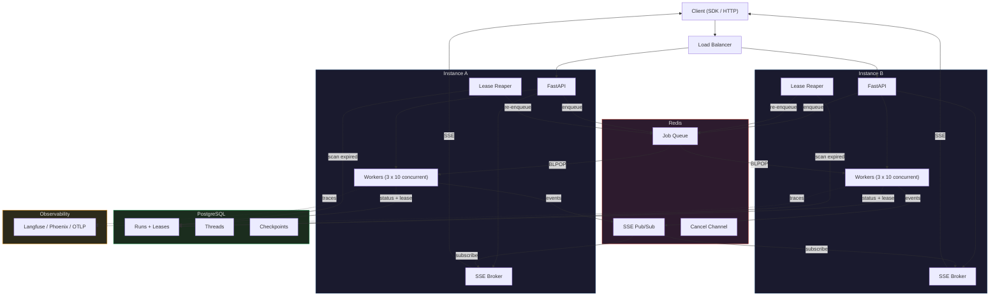
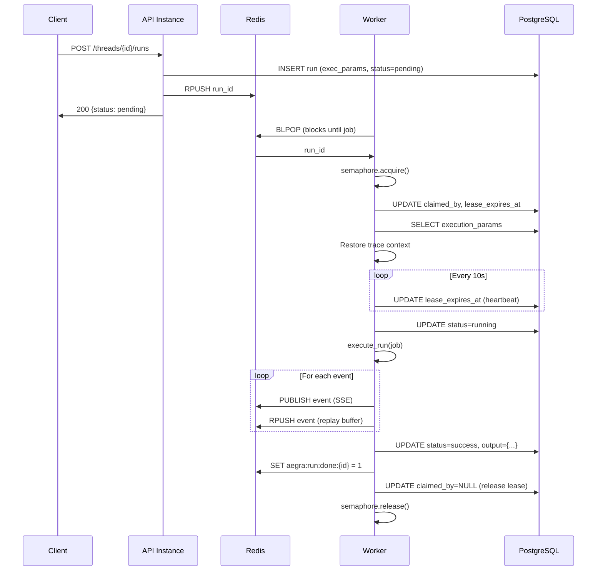
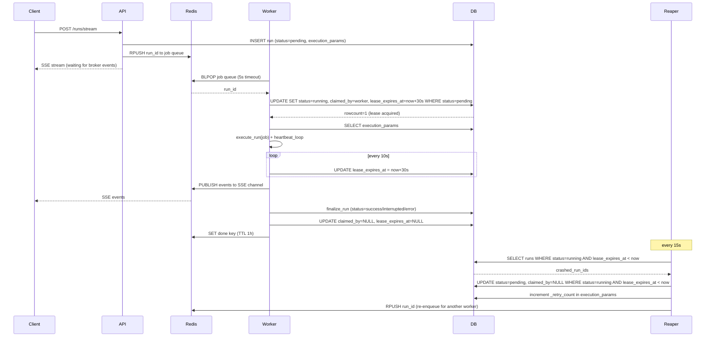
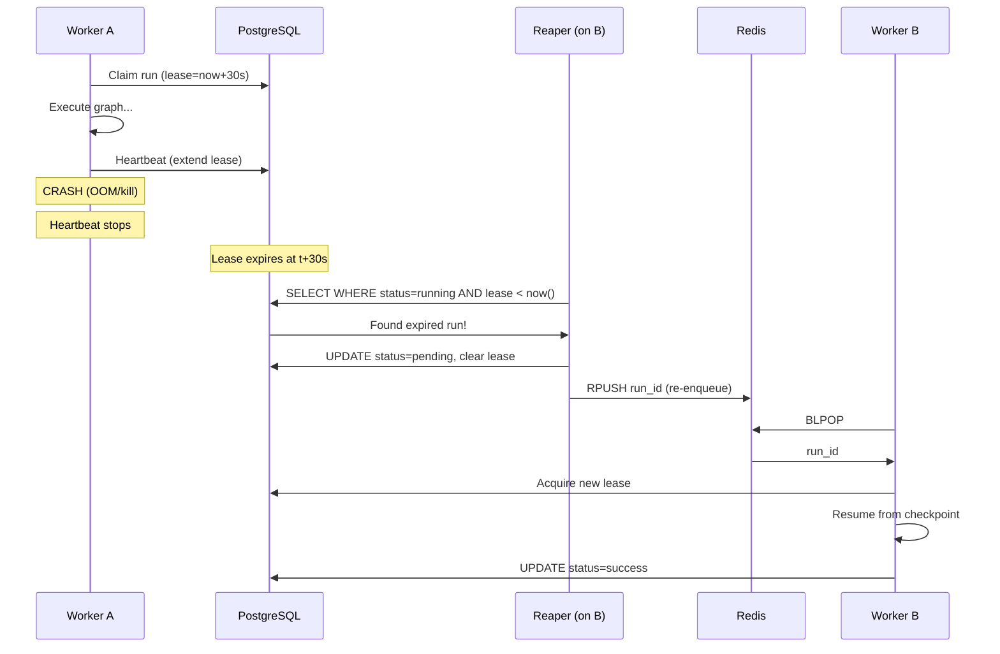
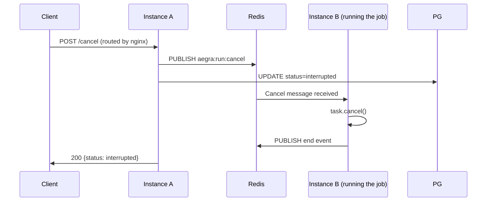

Aegra uses a worker-based execution model for production deployments. Runs are dispatched through a Redis job queue and executed by concurrent asyncio workers across any number of instances. Lease-based crash recovery ensures no run is lost, even if an instance dies mid-execution.

In dev mode (`aegra dev`), none of this is needed — runs execute as simple in-process asyncio tasks.

## System overview

<a href="https://mermaid.live/view#pako:eNqdVV1vmzAU_SsWeWm1ZAnJtKl5mBSnXdcNKbRB2sMyTQZuAgqxMwNtqtL_PtsYhgdJu5GHXHPO_Tq-Nk9WwEKwpshaJ-whiAjPkHe5okg88yQGmn1fWaWBzpaXX9EQffY893xl_ShJDhYEh5EQYZIQGgBXUDMCGgw-Cl71Ms39DSf7CN3QNJMeP2ciRLVAszq0fGbujYI_kTQTtoF9Y3wLPFW4ttHZBB2QPUIBo0HOuch-bvjcAdkDVy4OkBT0C4ODOdtqznJ5pZeNruq6VGN1FV1gFarEgIbHRcBNEXBLBPyCCPjfRcCvEAG_JAI2RMBdYBWqJYJT4kqu1pv2vNxBGIsU7CBqUrZR8G0OOQjkC_NL20Dd3F_mvm5GLIZiZRDmUvdEDrsy0DwilEJSc7r2zr0WfJel2YbD8tYxNc5pKusUf-gNUjKb9XoRBxJKjrbMciIItnsW00wyGquTBS28K0fQF34K_J74cRJnj2ZSTgKQER1CN-tcbP0QuREDGh-EtfActyt-Pc8F0F9S2kIrTI2N7kSVqVDsuAu3-Pu8HMXr_a8dyhz3YpzTQm-oycBHGaWtYCFWGvDYF2Wap_MkRw9v5aFYYpQKfcUZKG6jXZ2Io57lcjgSORyFmpiufo7zqsuspAWEIjjsYw5hBwm_hlRG4jDo2kkjUAen1eNbwcvUwBV68FrtdVH0TGePCTQ-EWgdJ8m0ZxObjKGfZlLqaW-0nrx7P-oHLGF82oOR_HX64__zr68c7T4Obb_hHowmF2P_uLt7XaX1hecfv_EHAqfSynNcZxz7tl97ricXgT02Pa0-snbAdyQOxYf8ycoi2KlPekj41np-_g36aXY9" target="_blank" rel="noopener">View fullscreen ↗</a>

Each instance runs multiple worker loops (default 3), and each worker loop handles up to `N_JOBS_PER_WORKER` concurrent runs (default 10) via an asyncio semaphore. Total capacity per instance is `WORKER_COUNT` x `N_JOBS_PER_WORKER` — 30 concurrent runs by default.

## Job lifecycle

When a client creates a run, the API validates the request, persists the run to PostgreSQL with serialized execution parameters, and pushes the run ID onto a Redis list. A worker on any instance picks it up via `BLPOP`, claims a lease, and executes the graph.

<a href="https://mermaid.live/view#pako:eNqNU9Fum0AQ_JUVTyC5ttNHJEdKHJpaQgkFW36JhI5jY18Nd-TuiGxZ_vcuhrRQWrW8nMTM3M7O7p0drnJ0fHAMvtUoOT4IttOsfJFAX8W0FVxUTFpYAjOwLARKOwbvolUDN8dKGsvoojEpbigx5sKMsW2DbZU-oB6D0WODRsrYncbkW_giW87y0-0tlfQhek7WMLN7jSw3s7PILzNdy64MMYgXPfqwekqCeA0EgYtH5CkVYaWZADm2tVlUKHMhd15fF_sQR5vka6NKRd6Hlj58ns_h3Kp96OSXD3vbVn4fRs8RuFmh-MFALa0o4LvKuioxkbb-4PZt-8tgyaq90jhl_K0WGl3vF960s4ke7tYB8IKJEvM0O02gQGYwxWNFdJMyOxQkQRgs19C0XluhZNf_oGqMxlJNsJpxBK6kxaP96KhQqoLgHfUJbuad7g-OfncB7h5pnBky27VASfVT6mm7UVAekrIcWGt9Y0qY2wbYc_VFaUDG94DvPze0N4Rocx-uaIpXFNwkCbwRp51zx9BYFewEWf36ivp_XZuaczS0UKq2VW0X5-l0ehksQxKsgSG9MJ-68HMl0W_WFRZw84_hLp42Ydj4uqbbZuz9ZWE6kus5E3BK1CUTOT3ys2P3WF6fe870wblcfgAuaUK2" target="_blank" rel="noopener">View fullscreen ↗</a>

Key details:

1. **Execution params** are stored in PostgreSQL alongside the run, so any worker can reconstruct the full job context (user identity, config, trace metadata, interrupt settings, etc.).
2. **Lease acquisition** is atomic — `UPDATE ... WHERE claimed_by IS NULL` ensures only one worker wins the race.
3. **Heartbeats** extend the lease every 10 seconds. If a worker crashes, the lease expires and the run becomes eligible for recovery.
4. **OpenTelemetry trace context** propagates across the Redis queue boundary, so traces span the full request lifecycle.

### Streaming run with crash recovery

The full picture — a streaming run shows how the client SSE connection, worker execution, and reaper recovery all interact:

<a href="https://mermaid.live/view#pako:eNqdVE1r4zAQ_SuDTw5tScPSi9kUksbQQEhN7NDLglHsaaNNLLmSvGm29L_vyHK-ncv6ZEYz8-a9edKXl8kcvQA8jR8VigxHnL0rVvwSQF_JlOEZL5kw8LTmKMxlfBCNL4MzzLm-DL9KtUJ1GR8N21qw0ua6E4d-9_hIcAFEL3ECXVUJ3dVG4W5cOqOM0TCA8TQOZwlQBvjaMFPpfoki5-L9FvATs8pwKVKCY4XuHBfXgwcwi-bxsy1PeQ5Gwm-5ANKnwkMuJbuhAojjENwc4G8YNwQDb1LBQkmiC_iHsiyMK3YiHLCGk-glOiCA_6DB8AJlZZrR6kQL6EqDZrCzdpb3PBoNkhDiMIGGNqWKmna2ZtQ0Txfb_qYuuYU1Mo0pfpZcoU6Z6Qu5uflxr-H1OZyFcCqcQxsNT-aQm0xWwvR74NfNgGUfFXXLOy3DxeEkfEou9D_L3PV2aZgSAZ_E6cANLJH8sUBm0rWUpauzf1ZhtYXefdPrmiznfKEPDWNXR0TbVxTNh5MxGcJt0hrCrjxbMiFwfbajY1O4_BYp3rhga_63Zrd3qK6yDLXucmFQqao0mHfpR6rO9U0fbXU6n0xadmrD7aysS3IpEFa4BT9JJtBb7l06lQZBkq7NRQx2Ij_oHWEbPl2tvZGn5mnsB4Pp6FL-n1b-Y1_toDLF9JJYOZ-3ATb0z-_2mRz_N8sJEBeZwoLWCKlCo7ZpbXgKX_HxvrjtJfEV3qFw19w-EExIsySJ3YXseLfgFagKxnN6kr88OivqxzlnauV9f_8DKe3lLA==" target="_blank" rel="noopener">View fullscreen ↗</a>

## Crash recovery

Every instance runs a `LeaseReaper` background task that scans for runs with expired leases. When a worker crashes (OOM, kill signal, network partition), its heartbeat stops and the lease expires. The reaper resets the run to `pending` and re-enqueues it. The new worker resumes from the last checkpoint.

<a href="https://mermaid.live/view#pako:eNptk09PwkAQxb_K2FOJiCbeGjVpocIBpRZJLyZm3Y6wge7W_aMkxO_uLK2CQE9N9r3fezPtbgKuSgwiCAx-OJQcB4LNNateJNBTM20FFzWTFooYmIFC6SVqiI_Ps6E_z5Sxc43Tp_GxIkdWk5dU7VuoJCSdE8JGUwpzokayVyN5kY2iiC_u7rJhBP0VExVoJyFcITN4K9XX-fWV6ezpijiCdI3cWQSatV70er0DzAgp8g2ZhRDXFmUJW1rnN-9RkVd9UgUP6-fxdAThZPJwuRSrVeeUZkc0VtXmGORjxz4EcF0LjQZIa333X22ztbbhNB2n_WcoRmmeEpJZZ25pbCnkHOLHQdMXboDmD9tC2ZC8DSSCe-Voqiaq9As7OxEyywbx8x--pj0Qvguc4LpJODDlEeTZjJZBwFdRQqjxAiX9WW63uyJphMk4m2St33-VJGpdezJfIuYfjkqCxK_9zO25N-VoXIXwrlUFfIF8WSsh7QHk_yTGcY7GBF0IKtQVEyVdgU1gF1htL0PJ9DL4_v4BvGz9cA==" target="_blank" rel="noopener">View fullscreen ↗</a>

The reaper runs on every instance (default every 15 seconds). This is safe — the atomic lease acquisition prevents duplicate execution.

## Cross-instance cancellation

Cancel requests can arrive at any instance, but the run may be executing on a different one. Aegra uses Redis pub/sub to propagate cancellation across instances.

<a href="https://mermaid.live/view#pako:eNplkUtrwzAQhP_KolMMfYQeBQ3YTmkDhRonueWiWIurJl67eoQW4__edUWbBOs638yOdntRtRqFBOHwMyBVuDSqtqrZEfDrlPWmMp0iDzkoB_nRIPmpmI7iipxXHAHpFChHoERt3FTLrswZzGwgMlSDf0f4aPfJjqIpv10sUgnF23oD99VIHxlug0cN-2-g2tBXEtGU0ZLRbfa6Wr-AQv6U5FwZbWeoeJawLZbp5gm4gA_u0ZBHa0PHqRErGcsk5HFgg86pGsFiheb0x2SR8cod7uKIWXJWLpogacDT_xLHCrmEh_kc-jhfwkWBQdyAaNA2ymi-Ui94Jc3vvbSyBzEMP0THj5M=" target="_blank" rel="noopener">View fullscreen ↗</a>

## Dev vs production mode

| | Dev (`aegra dev`) | Production (`aegra up` / `aegra serve`) |
|---|---|---|
| Executor | `LocalExecutor` — `asyncio.create_task()` | `WorkerExecutor` — BLPOP + semaphore + lease |
| Redis required | No | Yes |
| Crash recovery | No (single process) | Yes (lease reaper) |
| Cross-instance cancel | N/A | Yes (Redis pub/sub) |
| SSE broker | In-memory queue + list | Redis pub/sub + replay buffer |
| Scaling | Single instance | Horizontal (shared Redis + PostgreSQL) |

<Tip>
  `aegra dev` is designed for fast iteration — no Redis, no workers, no leases. Just start coding and your runs execute immediately in-process.
</Tip>

## Redis data layout

| Key | Purpose | Written by | Read by |
|:----|:--------|:-----------|:--------|
| `aegra:jobs` | Job queue (BLPOP) | API (RPUSH) | Worker (BLPOP) |
| `aegra:run:{run_id}` | SSE live events | Worker (PUBLISH) | API (SUBSCRIBE) |
| `aegra:run:cache:{run_id}` | SSE replay buffer | Worker (RPUSH) | API (LRANGE) |
| `aegra:run:counter:{run_id}` | Event sequence counter | Worker (INCR) | API (GET) |
| `aegra:run:cancel` | Cancel commands | API (PUBLISH) | Worker (SUBSCRIBE) |
| `aegra:run:done:{run_id}` | Completion signal (TTL 1h) | Worker (SET) | API (EXISTS) |

## Configuration

All worker settings are configured via environment variables. See the [environment variables reference](/reference/environment-variables) for the full list.

| Variable | Default | Description |
|:---------|:--------|:------------|
| `REDIS_BROKER_ENABLED` | `false` | Enable Redis workers and broker |
| `REDIS_URL` | `redis://localhost:6379/0` | Redis connection URL |
| `WORKER_COUNT` | `3` | Worker loops per instance |
| `N_JOBS_PER_WORKER` | `10` | Concurrent runs per worker loop |
| `BG_JOB_TIMEOUT_SECS` | `3600` | Max execution time per run (1 hour) |
| `BG_JOB_MAX_RETRIES` | `3` | Max retry attempts before a crashed run is permanently failed |
| `STUCK_PENDING_THRESHOLD_SECONDS` | `120` | How long a pending run can sit before the reaper re-enqueues it |
| `LEASE_DURATION_SECONDS` | `30` | Lease TTL before reaper reclaims |
| `HEARTBEAT_INTERVAL_SECONDS` | `10` | Lease extension frequency |
| `REAPER_INTERVAL_SECONDS` | `15` | Expired lease scan frequency |
| `POSTGRES_POLL_INTERVAL_SECONDS` | `5` | Fallback poll interval when Redis is unavailable |
| `WORKER_DRAIN_TIMEOUT` | `30.0` | Graceful shutdown wait time (seconds) |

<Note>
  When Redis is unavailable, workers fall back to polling PostgreSQL for pending runs at `POSTGRES_POLL_INTERVAL_SECONDS` intervals. This keeps the system functional during Redis outages, though with higher latency.
</Note>

## File map

| File | Purpose |
|:-----|:--------|
| `services/executor.py` | Factory — selects `LocalExecutor` or `WorkerExecutor` |
| `services/base_executor.py` | Abstract interface: submit, wait, start, stop |
| `services/local_executor.py` | Dev mode: `asyncio.create_task` |
| `services/worker_executor.py` | Production mode: BLPOP + semaphore + lease + heartbeat |
| `services/run_executor.py` | Shared execution logic (used by both executors) |
| `services/run_status.py` | Database status updates |
| `services/run_preparation.py` | Run creation (validate, persist, submit) |
| `services/lease_reaper.py` | Background task recovering crashed worker runs |
| `services/broker.py` | In-memory broker + factory |
| `services/redis_broker.py` | Redis pub/sub broker for SSE |
| `services/streaming_service.py` | SSE orchestration (replay + live) |
| `models/run_job.py` | `RunJob` Pydantic model (serialized execution params) |
| `core/orm.py` | Run table with `execution_params`, `claimed_by`, `lease_expires_at` |
| `core/active_runs.py` | In-memory task registry (dev mode only) |
| `core/redis_manager.py` | Redis connection pool singleton |
